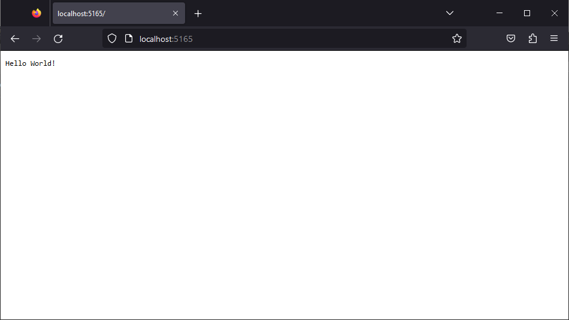

We're going to start with a completely new .NET web application.

First, make sure you've got the right version of .NET installed. We're using .NET 7 for these examples, so run:

```
D:\Projects> dotnet --version
7.0.201
```

As long as it starts with a 7, you should be good to go.

## Creating the Rockaway.WebApp application

Next, we're going to use the `dotnet` command and one of the built-in project templates to create our new web application.

> <i title="Info" class="fa-solid fa-circle-info"></i> Running `dotnet new --list` will show you a list of all the available project templates. There's a *lot* of them in .NET 7, covering everything from Windows Forms applications to iOS class libraries.

Create a new folder called `rockaway`, then inside your new folder, run:

```
D:\Projects\rockaway> dotnet new web -o Rockaway.WebApp
D:\Projects\rockaway> cd Rockaway.WebApp
D:\Projects\rockaway\Rockaway.WebApp> dotnet run
```

Somewhere in the output, you'll see a line like:

```
Now listening on: http://localhost:5165
```

so open that URL in a browser -- you might find you can Ctrl-Click on the URL in the terminal window; if not, copy & paste it -- and you should see something like this:



{: .note }
The URL that your web app runs on uses a port number that's generated at random when you create the app; if you want to change it, it's defined in the `launchSettings.json` file which you'll find in `Rockaway.WebApp/Properties/`

Let's take a look at the code that makes it work. Open up `Rockaway.WebApp/Program.cs`: 

```csharp
// Rockaway.WebApp/Program.cs

var builder = WebApplication.CreateBuilder(args);
var app = builder.Build();

app.MapGet("/", () => "Hello World!");

app.Run();
```

That's an entire web application, including the server, in four lines of C# code -- not bad.

> <i title="Info" class="fa-solid fa-circle-info"></i> The `dotnet new web` template we've used here uses **minimal APIs** to map incoming HTTP requests onto code - in this case, the line:
>
> ```csharp
> app.MapGet("/", () => "Hello World!");
> ```
>
> maps any HTTP GET request to `/` (the root URL) to an inline function which takes no arguments, and returns the string `"Hello World!"`. We'll learn more about minimal APIs and request routing in the next section.

## Testing "Hello World"

At the moment, our app works just fine, but as we add more complexity to it, there's a risk we'll break something -- and the more features we build into our application, the greater the risk that one of our changes might accidentally affect another part of the code.

To manage this, we're going to create automated tests for every feature and path through our application code. That way, if we *do* accidentally break something, we'll know about it straight away -- instead of finding out when we deploy our code and get inundated with support calls from angry customers.

Let's add some tests to our project. We're also going to create a solution file, to manage the dependencies between our web project and our test project:

```transcript
dotnet new sln
dotnet sln add Rockaway.WebApp
dotnet new xunit -o Rockaway.WebApp.Tests
dotnet sln add Rockaway.WebApp.Tests
```

Now, we can run all the tests in our solution using:

```transcript
dotnet test
```

and we should get output something like:

```
Passed!  - Failed:     0, Passed:     1, Skipped:     0, Total:     1, Duration: < 1 ms
```

Awesome! The tests all pass - ship it!

...hang on, what are we actually testing here? Let's take a look in our new test project:

```csharp
// Rockaway.WebApp.Tests/UnitTest1.cs

namespace Rockaway.WebApp.Tests;

public class UnitTest1
{
    [Fact]
    public void Test1()
    {

    }
}
```

OK, code review time. There's a bunch of things I don't like about this test.

1. It's not actually testing anything.
2. `UnitTest1` is a terrible name for a class
3. That's not how I like my code formatted. The braces are all in the wrong places.

## Testing web apps using WebApplicationFactory

Right now, our app really doesn't do very much: if we hit the `/` endpoint, we get back `Hello World!` -- but more importantly, that `Hello World` comes attached to an HTTP `200 OK` response, and that's a big deal. 

If you've ever tried to open a website and got back a `500 Internal Server Error` or a `502 Bad Gateway` -- broken website, right? And broken websites are bad, so it's probably a good idea if we try not to do that.

We're going to add a really, really high-level test here: it's going to simulate an `HTTP GET` request to the "homepage" of our website, the root url `/`, and verify that we get back an `HTTP 200 OK` response. No matter what changes we make to our application, we're always going to want our homepage to return a `200 OK`.

To do this, we're going to use a thing called the `WebApplicationFactory`, part of the `Microsoft.AspNetCore.Mvc.Testing` library.

From the `Rockaway.WebApp.Tests` folder:

```transcript
dotnet add package Microsoft.AspNetCore.Mvc.Testing
```

Next, we'll need to modify our project so that we can make our web application's code visible to our testing project.

First, we need to add a **reference**. From our `Rockaway.WebApp.Tests` project folder:

```transcript
dotnet add reference ..\Rockaway.WebApp
```

Now we need to expose our **entry point** to the test project -- which is where it gets a bit gnarly. .NET 7 has a feature called **top level statements**:

```csharp
// top level statements:
Console.WriteLine("Look! Top level statements are awesome!");

// without top level statements:
internal class Program {
  public static void Main() {
    Console.WriteLine("Without top level statements, there's a lot more boilerplate code");
  }
}
```

Behind the scenes, the C# compiler is actually wrapping our code up in a `Program.Main()` method -- but because this all happens by magic, the resulting `Program` class is marked as `internal` -- which means that other projects, like our test project, can't see it.

There are two ways to get around this. One is to modify the `Rockaway.WebApp.csproj` file and add this chunk of XML:

```xml
<ItemGroup>
  <InternalsVisibleTo Include="Rockaway.WebApp.Tests" />
</ItemGroup>
```

The other is to add a line to our `Program.cs` which explicitly makes our `Program` class `public`:

```csharp
// Add this to the end of Program.cs

public partial class Program {}	
```

Next, delete `UnitTest1.cs` from our test project, and add a new file called `WebTests.cs`

```csharp
// Rockaway.WebApp.Tests/WebTests.cs


```

Now, when we run `dotnet test`, our test code will spin up a standalone instance of our web app, send an HTTP request to `/`, and verify the response has a `Success` status code.

## Formatting code with .editorconfig and dotnet format

Finally, we're going to apply some formatting rules to our project, and set up a `.editorconfig` file to enforce these rules.

{: .note }
EditorConfig is a way to maintain consistent coding styles for multiple developers working on the same project across various editors and IDEs. You can read more about it at [editorconfig.org](https://editorconfig.org)

You can find the  `.editorconfig` file we'll use here: [.editorconfig](examples/module01/.editorconfig)

Add this file to your solution folder alongside your `Tikitapp.sln` file. 

{: .note }
**For Windows Users:** To create an `.editorconfig` file within Windows Explorer, you need to create a file named `.editorconfig.` (note the trailing dot), which Windows Explorer will automatically rename to `.editorconfig` for you.

After adding the `.editorconfig` file, reformat all the files in your project to match the project's new formatting settings.

Then run:

```transcript
dotnet format
```

That will reformat all the `.cs` files in the solution to conform to the code style specified in `.editorconfig`

{: .highlight }
The `.editorconfig` used in this  workshop uses tabs for indentation, not spaces. I used to prefer spaces for indentation. Then I read Adam Tuttle's article  "[Tabs vs Spaces: It's an Accessibility Issue](https://adamtuttle.codes/blog/2021/tabs-vs-spaces-its-an-accessibility-issue/)", and that completely changed my mind. I can use tabs. No big deal. But there are developers out there for whom tabs vs spaces is a Big Deal. Developers with visual impairments who use an extra-large font size, who set their tab width to 1 character. Developers using Braille displays, for whom a tab only occupies a single Braille cell. So now I use tabs wherever I can.


