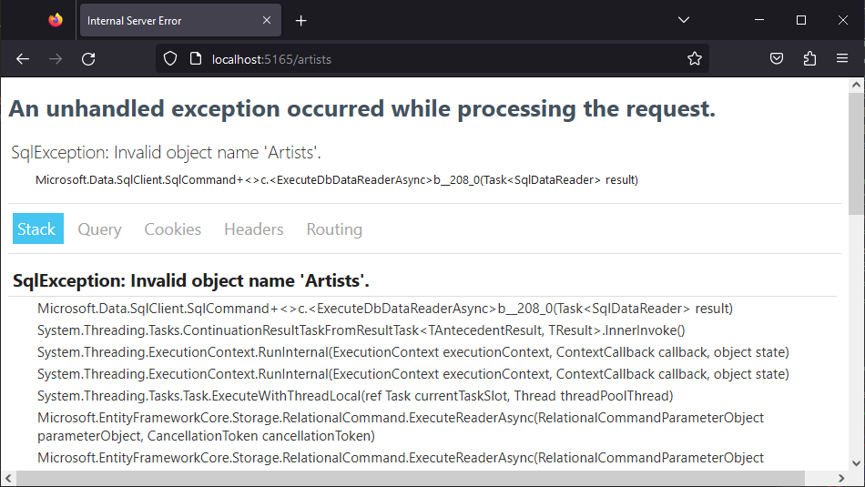
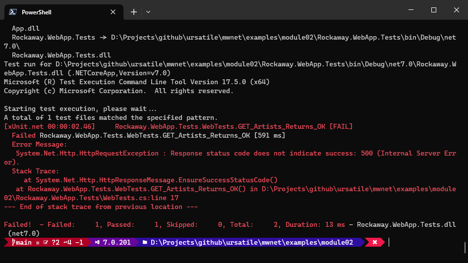

In the last module, we created a .NET web application with a single "hello world" endpoint, and added some testing around this to verify that it worked.

In this module, we're going to start adding some application data to our web app. The business scenario we're modelling here is tickets to rock concerts, so the first thing we're going to add here is a list of artists -- bands and musicians who are going to be performing at the shows we're selling tickets for.

First, though, we need to set up some infrastructure so we actually have a database to connect to.

## Running SQL Server using Docker

Docker is a platform for running virtualised applications. We're going to use Docker to create and run a stripped-down virtual machine known as a **container** which will host a local version of Microsoft SQL Server.

{: .note }
You'll need [Docker Desktop](https://www.docker.com/products/docker-desktop/) installed to use the examples in this section. You could also connect to a regular database running on a local or remote installation of Microsoft SQL Server, but the instructions in this handbook assume you're running Docker.

To download and the latest SQL Server 2022 image from Docker:

```
docker run -e "ACCEPT_EULA=Y" -e "SA_PASSWORD=p@ssw0rd" -p 1433:1433 --name rockaway-mssql-server -d mcr.microsoft.com/mssql/server:2022-latest
```

This will pull  the latest SQL Server 2022 image from Microsoft's Docker image repo, and start a new instance:

* `-e "ACCEPT_EULA=Y"` will automatically accept the End User License Agreement (required to run SQL Server)
* `-e "SA_PASSWORD=p@ssw0rd"` will set the `sa` password to `p@ssw0rd`
  * `sa` is the *system administrator* account built in to SQL Server. We're using `sa` here to connect to our new server instance and set up a database

* `-p 1433:1433` will map port 1433 on `localhost` to port 1433 on the Docker host.
  * 1433 is the default network port used by SQL Server.

* `--name rockaway-mssql-server` assigns a name to our host, which we'll use in the next step to run SQL commands on that host.

Use `docker container list` to see a list of running containers and check that our instance has started correctly:

```bash
D:\>docker container list
CONTAINER ID   IMAGE                                        COMMAND                  CREATED         STATUS         PORTS                    NAMES
dbc13666dc93   mcr.microsoft.com/mssql/server:2022-latest   "/opt/mssql/bin/perm…"   5 minutes ago   Up 5 minutes   0.0.0.0:1433->1433/tcp   rockaway-mssql-server
```

Next, we'll run a SQL script to create a user, set up an empty database, and add our new user to the `db_owner` role in that database. The script is available at [create-rockaway-database.sql](examples/create-rockaway-database.sql):

```sql
-- create-rockaway-database.sql


```

To copy the script into our Docker container and run it:

```powershell
docker cp create-rockaway-database.sql rockaway-mssql-server:/opt/create-rockaway-database.sql
docker exec -it rockaway-mssql-server /opt/mssql-tools/bin/sqlcmd -S localhost -U sa -P p@ssw0rd -i /opt/create-rockaway-database.sql
```

You should get a response something like:

```
Microsoft SQL Server 2022 (RTM) - 16.0.1000.6 (X64)
	Oct  8 2022 05:58:25
	Copyright (C) 2022 Microsoft Corporation
	Developer Edition (64-bit) on Linux (Ubuntu 20.04.5 LTS) <X64>
Changed database context to 'rockaway'.
Adding user [rockaway_user] to database [rockaway]
Done.
Adding user [rockaway_user] to role [db_owner] in [rockaway] database
Done
```

{: .warning }

> If you're using an Apple Mac with the new Apple Silicon M1 or M2 processors, none of this will work, because there isn't an officially supported SQL Server image for the ARM64 architecture used in the M1/M2 Macs. 
>
> You can run the [Azure SQL Edge](https://hub.docker.com/_/microsoft-azure-sql-edge) Docker image on ARM64 Macs using this Docker command:
>
> ```bash
> docker run --cap-add SYS_PTRACE -e 'ACCEPT_EULA=1' -e 'MSSQL_SA_PASSWORD=p@ssw0rd' -p 1433:1433 --name azuresqledge -d mcr.microsoft.com/azure-sql-edge
> ```
>
> That will give you a SQL database instance, but the ARM64 version of SQL Edge doesn't include the `sqlcmd` tool -- so even if you can get it to start, you'll need to connect from a tool like DataGrip and run the SQL script to create the database manually.
>
> Yay progress... 


## Adding the Artist class

1. Create a new folder in `Rockaway.WebApp` called `Data`
2. Create a new folder inside `Data` called `Entities`
3. Create a new class inside `Entities` called `Artist.cs`:

```csharp
// Rockaway.WebApp/Data/Entities/Artist.cs


```

This is a relatively simple class, but there are a handful of things to notice here:

**First**, we're using a GUID (Globally Unique Identifier) as an identifier. We need a way to uniquely identify two artists, and we can't rely on unique names because band names aren't as unique as you might think: [Classic Rock has a whole article about bands with the same names.](https://www.loudersound.com/features/different-bands-same-name-nirvana-iron-maiden-slayer)

Historically, lots of databases used an integer as an identifier.

| Integer keys                                                 | GUID keys                                                    |
| ------------------------------------------------------------ | ------------------------------------------------------------ |
| <i class="fa-regular fa-thumbs-up"></i> Small (4 bytes)      | <i class="fa-regular fa-thumbs-down"></i> Large (16 bytes)   |
| <i class="fa-regular fa-thumbs-up"></i> Easy to remember *("hey, it's customer 27!")* | <i class="fa-regular fa-thumbs-up"></i> Hard to remember *("OK, the ID is... you got a pen? AB7C9DFA-0278-BBF0-A45F-A78B9C89D78F... got that?")* |
| <i class="fa-regular fa-thumbs-down"></i> Easy to guess *("oooh... I wonder who customer 28 is!")* | <i class="fa-regular fa-thumbs-up"></i> Basically impossible to guess. |
| <i class="fa-regular fa-thumbs-up"></i> Good for monolithic systems where IDs are assigned by a central authority. | <i class="fa-regular fa-thumbs-up"></i> Good for distributed systems where we might need to merge IDs that were generated offline |
| <i class="fa-regular fa-thumbs-up"></i> Auto-incrementing means new rows are added to the *end* of the table, so inserts are fast | <i class="fa-regular fa-thumbs-down"></i>New IDs don't increment (unless we use a special generator) so inserts might mean repaginating data. |

We're going to use GUIDs for our IDs. Mainly because I like GUIDs; there are some legitimate criticisms of using GUIDs as keys, but honestly, they're mostly academic unless we're dealing with terabytes of data, or specific scenarios where you need to insert a lot of records in a hurry. For the vast majority of day-to-day applications, GUIDs work just fine.

**Second**, we're defaulting the `Name` and `Description` properties to the empty string. Strings in .NET are `null` until they're assigned a value, but .NET 7 doesn't like `nulls`; we need to either mark these properties as nullable by making them `string?` instead of `string`, or use a `!` annotation to suppress the compiler warning -- or just give them a default value so we know they'll never be null.

{: .note }
Imagine we wrote some search code that ran `artist.Name.Contains("van halen")` - if `Name` was null, that code would throw a `NullReferenceException`. Making `Name` non-nullable means this won't happen.

**Third**: we've use a `[MaxLength]` attribute on the `Name` property to restrict it to 100 characters. Choosing sensible field lengths is vitally important when creating a data schema; the best way to find sensible lengths is to look for real-world outliers. The `Artist` table in our model is to store artists -- bands, musicians, orchestras -- and searching the web for long band names gives us:

* `The Silver Mount Zion Memorial Orchestra and Tra-La-La Band` *(60 letters)*
* `Tim and Sam's Tim and the Sam Band with Tim and Sam` *(52 characters)*
* `…And You Will Know Us By The Trail Of The Dead` *(48 letters)*
* `The Presidents of the United States of America` *(46 letters)*
* `Richard Cheese & Lounge Against The Machine` *(43 letters)*

So 100 Unicode characters -- `nvarchar(100)` -- looks like a pretty good choice for our artist name column.

## Running SQL Server using Docker

Docker is a platform for running virtualised applications. We're going to use Docker to create and run a minimal virtual machine - known as a **container** - that will host a local version of Microsoft SQL Server.

{: .note }
You'll need [Docker Desktop](https://www.docker.com/products/docker-desktop/) installed to use the examples in this section. You could also connect to a regular database running on a local or remote installation of Microsoft SQL Server, but the instructions in this handbook assume you're running Docker.

To download and the latest SQL Server 2022 image from Docker:

```
docker run -e "ACCEPT_EULA=Y" -e "SA_PASSWORD=p@ssw0rd" -p 1433:1433 --name mssql2022 -d mcr.microsoft.com/mssql/server:2022-latest
```

This will pull  the latest SQL Server 2022 image from Microsoft's Docker image repo, and start a new instance:

* `-e "ACCEPT_EULA=Y"` will automatically accept the End User License Agreement (required to run SQL Server)
* `-e "SA_PASSWORD=p@ssw0rd"` will set the `sa` password to `p@ssw0rd`
* `-p 1433:1433` will map port 1433 on `localhost` to port 1433 on the Docker host. 1433 is the default network port used by SQL Server.
* `--name mssql2022` assigns a name to our host, which we'll use in the next step to run SQL commands on that host.

Use `docker container list` to see a list of running containers and check that our instance has started correctly:

## Installing Entity Framework Core

Next, we're going to install EF Core, and set up a `DbContext` that we can use to connect our application code to a database.

First, we'll install [the NuGet package](https://www.nuget.org/packages/Microsoft.EntityFrameworkCore.Sqlite) that gives us EF Core, the relational database tools, and the Microsoft SQL Server database provider. In the `Rockaway.WebApp` project, run:

```powershell
dotnet add package Microsoft.EntityFrameworkCore.SqlServer
```

### Creating a DbContext

EF Core manages all data access through something called a DbContext. Here's the code for the DbContext we'll use in our Rockaway app:

```csharp
// Rockaway.WebApp/Data/RockawayDbContext.cs


```

Next, we'll modify `Program.cs` and register `RockawayDbContext` as a service. We're also going to add an endpoint at `/artists` that'll list all the artists in our database:

```csharp
// Rockaway.WebApp/Program.cs


```

Finally, we need to add a database connection string to our app configuration -- we'll add this to the `appSettings.Development.json` file so that it'll only apply when we're running our app in `Development` mode.

```json

```

{: .note }
The connection string we're using here includes `TrustServerCertificate=true` -- this is required to connect to the SQL instance running in our Docker container, because the certificate that's used to encrypt our database connection isn't recognised as valid by Windows. For local development, this is fine, but in production, you should never ignore or override a certificate warning like this.

Now, if we run our app and open `/artists` in a browser:



That's an error, but it's a **good** error. It's telling us that our application ran, connected to the database, asked for a list of artists, and the database said "whoa, hang on, there's no such table!"

In a moment, we'll create one. But first, let's create a test for this new endpoint, so that we don't end up having to open a browser every time we want to check whether our code is working.

We'll add a new test method to our `WebTests` class:

```csharp
// Rockaway.WebApp.Tests/WebTests.cs

```

Run `dotnet test` to confirm that it fails:



Sweet. That's red; when it goes green, we know it's working.

## Using EF Migrations

Managing changes to databases has always been a challenge. Entity Framework includes a feature called **migrations**, which gives us a powerful set of tools to manage changes to our database from within our application code.

To use migrations:

1. Install the `dotnet ef` tooling:

   ```powershell
   dotnet tool install --global dotnet-ef
   ```

2. Add the `Microsoft.EntityFrameworkCore.Design` package to our `Rockaway.WebApp` project:
   ```powershell
   dotnet add package Microsoft.EntityFrameworkCore.Design
   ```

3. Verify that the tools are correctly installed by running `dotnet ef`. If it worked, you'll get a picture of a unicorn. Really.
   ```
                        _/\__
                  ---==/    \\
            ___  ___   |.    \|\
           | __|| __|  |  )   \\\
           | _| | _|   \_/ |  //|\\
           |___||_|       /   \\\/\\
   
   Entity Framework Core .NET Command-line Tools 7.0.9
   
   Usage: dotnet ef [options] [command]
   
   Options:
     --version        Show version information
     -h|--help        Show help information
     -v|--verbose     Show verbose output.
     --no-color       Don't colorize output.
     --prefix-output  Prefix output with level.
   
   Commands:
     database    Commands to manage the database.
     dbcontext   Commands to manage DbContext types.
     migrations  Commands to manage migrations.
   
   Use "dotnet ef [command] --help" for more information about a command.
   ```

Sweet. OK, let's create a migration.

## Working with EF Migrations

The very first migration in an EF project is normally called `InitialCreate`, so we'll use that.

```dotnetcli
dotnet ef migrations add InitialCreate
```

{: .highlight }
It's a good idea to run `dotnet format` after running any of the `dotnet` tools, since the templates and code style they use will not necessarily match the style we've defined with our `.editorconfig` file.

This will add a new folder, `Migrations`, to our project, and add two files to that folder. One of them,`RockawayDbContextModelSnapshot.cs`, we can ignore; EF Core uses it internally to keep track of the state of our data model.

The other one will be called something like `20230723030506_InitialCreate.cs` -- the filename is a `yyyyMMddhhmmss` timestamp, plus the name we specified when we created the migration:

```csharp
// Rockaway.WebApp/Migrations/20230723141942_InitialCreate.cs


```

Every migration has two methods - `Up` and `Down`. `Up` happens when we update the database; `Down` will be run if we need to roll back this migration.

This migration has not been applied to our database yet: it's a chance to look at what *will* happen when we apply it, and check it's doing the right thing:

:white_check_mark: EF Core has inferred from the property name `Id` that this should be the primary key on our `Artist` table
:white_check_mark: EF Core has mapped the `Guid` to an SQL `uniqueidentifier`
:white_check_mark: The `Id`, `Name` and `Description` columns are all marked as  `nullable: false` (remember, we're in .NET 7 here, where *nothing* is nullable unless you ask nicely)
:white_check_mark: It's picked up our `MaxLength(100)` attribute and set the column type for the 

Looks good. Let's apply the migration and update our database:

```
dotnet ef database update
```

That'll connect to the database and run the migration -- which creates the `Artist` table, complete with the `nvarchar(100)` column we talked about. It'll also create a tracking table called `__EFMigrationsHistory`, and insert a row into this table recording the fact that this migration has been applied.

## Using Migrations to Populate Data

As well as updating our database schema, we can use migrations to run SQL statements to insert or update data in our database. We're going to add another migration to populate our Artist table with some sample data.

```bash
dotnet ef migrations add InsertSampleArtistRecords
```

Then we'll edit our new migration to insert some Artist records.

{: .note }
We're specifying the values for the GUIDs in our SQL, so that we can tell at a glance whether a record is one of our sample data records or if it's real data from real users:

```csharp
// Rockaway.WebApp/Migrations/20230723142837_InsertSampleArtistRecords


```

Finally, apply our migration:

```
dotnet ef database update
```

We now have a database with 26 example artist records in it, and a request to our `/artists` endpoint will return a JSON document containing details of our artists.

## Exercise: Adding an Entity to the Data Model

The next entity we need to add to our data model is a **Venue**

A venue has the following properties:

* `Name` : Unicode text, up to 100 characters, not null
* `Address`: Unicode text, up to 500 characters, not null
* `City`: Unicode text, up to 100 characters, not null
* `CountryCode`: ANSI text (not Unicode); exactly 2 characters. This is a country code as defined by [https://en.wikipedia.org/wiki/ISO_3166-2](https://en.wikipedia.org/wiki/ISO_3166-2), not null
* `WebsiteUrl`: Unicode text, up to 255 characters. Null values are allowed.
* `Telephone`: ANSI text, up to 32 characters. Null values are allowed.

Add Venue to our application:

1. Create a `Venue` class in the `Data/Entities` folder, with the properties specified above
2. Add a migration to the project which will create the `Venues` table in the database.
3. Add a migration to populate `Venues` with a few sample records. (Find some concert venues online, or make something up!)
4. Add a venues property to the `RockawayDbContext`.
5. Add an endpoint in `Program.cs` to expose a list of venues at `/venues`
6. Add a test in `WebTests.cs` to confirm that the `/venues` endpoint exists, and returns a success status code.


