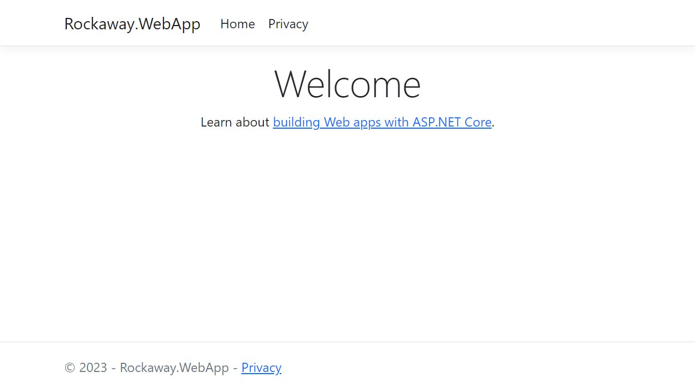
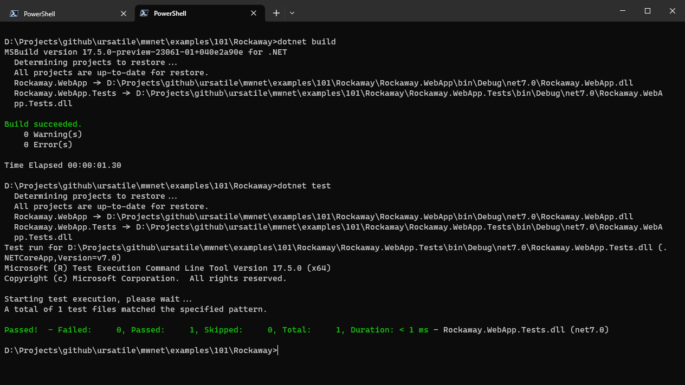

## Creating our first ASP.NET Core web app

You'll need the `dotnet` runtime installed. Check your version by typing:

```
dotnet --version
```

You'll need `dotnet` version 7 to run the examples in this workshop -- a few things won't work on .NET 6.

We're going to set up this project structure:

```
Rockaway/
	Rockaway.WebApp/			Our Rockaway web application
	Rockaway.WebApp.Tests/		xUnit tests for our app
	Rockaway.sln				The .NET solution file used to build our application
```

Start by creating the Rockaway web app:

```
mkdir Rockaway
cd Rockaway
dotnet new razor -o Rockaway.WebApp
```

Now, run it:

```
dotnet run --project Rockaway.WebApp
```

`dotnet` will build and run your project, and somewhere in the console output you'll see a URL - `http://localhost:5088/` or similar

> The port number is generated at random when you create a new project, and it's controlled by the `Properties/launchSettings.json` file.

If you get this screen, it worked.



### Adding a test project

Before we start actually writing code, we're going to set up a few more things which will make life easier for the rest of the project.

First, create a unit test project. We're going to use the xUnit test framework:

```
dotnet new xunit -o Rockaway.WebApp.Tests
```

Create a new solution:

```
dotnet new sln
```

Add both our projects to the solution:

```
dotnet sln add Rockaway.WebApp
dotnet sln add Rockaway.WebApp.Tests
```

Add a reference so that our test project can see our web project:

```
dotnet add Rockaway.WebApp.Tests reference Rockaway.WebApp
```

Check everything's wired up properly:

```
dotnet build
dotnet test
```

Our project doesn't do much yet, but if you see a few lines of green (and no red!), we're all good:



## Formatting code with .editorconfig

.NET includes the `dotnet format` tool, which will clean up and reformat your source code to conform to a particular project style. The coding style used on each project is controlled by a `.editorconfig` file

> Read more about the EditorConfig file format at [https://editorconfig.org/](https://editorconfig.org/)

We're going to add an `.editorconfig` file to our project and use `dotnet format` to keep our code formatted throughout this workshop.

You can find our config file here: [editorconfig](editorconfig)

> **Note**: Jekyll (which I used to write this handbook) won't publish a file starting with a `.`, so you'll need to rename `editorconfig` to `.editorconfig`. To create an `.editorconfig` file within Windows Explorer, you need to create a file named `.editorconfig.` (note the trailing dot), which Windows Explorer will then rename to `.editorconfig` for you. Why? I have no idea.

After adding the `.editorconfig` file, reformat all the files in your project to match the project's new formatting settings.

```
dotnet format
```

### Adding Serilog

Next, we're going to install the `Serilog` library, which gives us support for structured logging.

> Read more about Serilog and structured logging at [https://serilog.net/](https://serilog.net/)

First, install the `Serilog.AspNetCore` package into `Rockaway.WebApp`:

```
dotnet add Rockaway.WebApp package Serilog.AspNetCore
```

#### Configuring Serilog

Open `Program.cs` and add the two lines to configure Serilog support:

```csharp
// Program.cs

```

If you want to see the various log levels supported by Serilog and how they appear in your program output:

```csharp
Log.Information("Logging from Serilog: this is information");
Log.Debug("Logging from Serilog: this is debug");
Log.Warning("Logging from Serilog: this is warning");
Log.Error("Logging from Serilog: this is error");
Log.Fatal("Logging from Serilog: this is fatal");
```

OK, we're done. In the next module, we'll add some tests to verify that our app is working, and then get it running on Azure.

## Resources and Further Reading

* **Tutorial: Get Started with Razor Pages in ASP.NET Core**
  * [https://learn.microsoft.com/en-us/aspnet/core/tutorials/razor-pages/razor-pages-start?view=aspnetcore-7.0&tabs=visual-studio](https://learn.microsoft.com/en-us/aspnet/core/tutorials/razor-pages/razor-pages-start?view=aspnetcore-7.0&tabs=visual-studio)
* Serilog project homepage
  * [https://serilog.net/](https://serilog.net/)

* Serilog.AspNetCore at GitHub:
  * [https://github.com/serilog/serilog-aspnetcore](https://github.com/serilog/serilog-aspnetcore)
