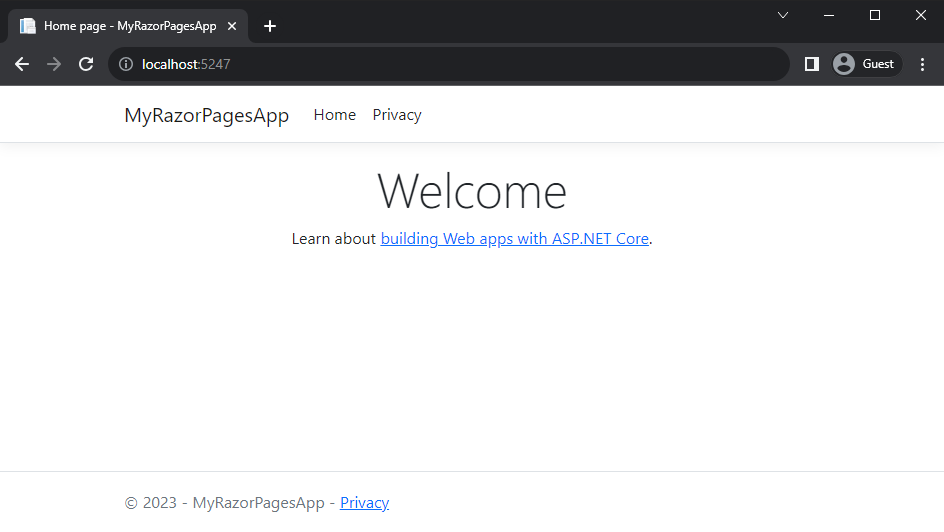

## What's a View Engine, Anyway? 

At the end of the last module, we built a simple calculator app that returned results as an HTML web page.

It turns out building HTML pages by hand isn't much fun. It's complicated, it's error-prone, there's all kinds of things that can go wrong, and when our HTML is wrapped up inside strings in our C# source files, we can't use automatic code formatters, syntax highlighting, and other tools that make our lives easier.

A **view engine** is a software component designed to populate and render templates and produce HTML pages. View engines exist on every web development platform, but on ASP.NET Core, the *de facto* standard view engine is called **Razor**.

Fundamentally, Razor allows us to create templates that combine HTML and C#, so we can put expressions. tests, loops and method calls directly into our HTML template code.

```html
@model Album

<!DOCTYPE html>
<html>
    <head>
        <title>@Model.Title</title>
    </head>
    <body>
        <h1>@Model.Title</h1>
        <h2>Album by @Model.Artist</h2>
        <ol>
            @foreach(var track in Model.Tracks) {
            	<li>@track</li>
			}
        </ol>
    </body>
</html>
```

```csharp
var model = new Album {
    Title = "Love Over Gold",
    Artist = "Dire Straits",
    Tracks = new[] { "Telegraph Road", "Private Investigations", "Industrial Disease", "Love Over Gold", "It Never Rains" }
}
```

Combining the Razor template with the **model** gives us the resulting HTML page:

```html
<!DOCTYPE html>
<html>
    <head>
        <title>Love Over Gold</title>
    </head>
    <body>
        <h1>Love Over Gold</h1>
        <h2>Album by Dire Straits</h2>
        <ol>
            <li>Telegraph Road</li>
            <li>Private Investigations</li>
            <li>Industrial Disease</li>
            <li>Love Over Gold</li>
            <li>It Never Rains</li>		
        </ol>
    </body>
</html>
```

## Introducing Razor Pages

ASP.NET Core gives us two different ways to work with the Razor engine.

**Razor Pages** is a page-based model; if you've worked with PHP or classic ASP, you'll find this model very familiar. It's great for simple applications with relatively simple interactivity.

**Model/View/Controller (MVC)** separates your application logic into **models**, containing your business data and logic; **views** -- your Razor templates -- and **Controllers**, which map incoming requests onto your application logic and return responses based on your views and models.

{: .info }
You can run Razor Pages and MVC side-by-side in the same ASP.NET Core application, so if you want to start out with the simpler Razor Pages approach and then add some controllers as your application grows more complex, that'll work just fine. There are even ways to reuse common elements like headers and navigation between Razor Pages and MVC, as we'll see later in this module.

## Creating a Razor Pages app using the template

To create a Razor Pages app:

```bash
dotnet new razor -o MyRazorPagesApp
```

Then run it with:

```
cd MyRazorPagesApp
dotnet run
```

If everything's wired up right, you'll get a browser window like this:



Let's take a quick look around, see what we've got here.

First up, `Program.cs`. This is the same basic structure as the one we saw in the last module, but with a bunch of extra bits:

```csharp 
// Program.cs
var builder = WebApplication.CreateBuilder(args);

builder.Services.AddRazorPages();

var app = builder.Build();

if (!app.Environment.IsDevelopment()) {
    app.UseExceptionHandler("/Error");
    // The default HSTS value is 30 days. You may want to change this for production scenarios, see https://aka.ms/aspnetcore-hsts.
    app.UseHsts();
}

app.UseHttpsRedirection();
app.UseStaticFiles();
app.UseRouting();
app.UseAuthorization();
app.MapRazorPages();
app.Run();
```

The lines which actually make Razor Pages work are:

```csharp
// This line plugs in all the Razor Pages components to your application
builder.Services.AddRazorPages();

// This line sets up the ASP.NET Core Routing infrastructure - Razor Pages
// relies on Routing to map your requests onto your pages
app.UseRouting();

// and the line which actually creates the request->page mapping is this one:
app.MapRazorPages();
```

Next, take a look in the `Pages` folder:

```
Pages
	/Shared
		_Layout.cshtml						(Razor markup for the common template used by pages in this site)
		_Layout.cshtml.css					(Stylesheets that will be imported into any page based on _Layout.cshtml)
		_ValidationScriptsPartial.cshtml	(pulls in the jQuery validation scripts from the ~/lib folder)
	_ViewImports.cshtml						(declares which namespaces to import into Razor pages in this project)
    _ViewStart.cshtml						(defines shared properties, like which layout pages should use)
    Error.cshtml							(Razor markup for the default application error page)
    Error.cshtml.cs							(C# codebehind for the default error page)
    Index.cshtml							(Razor markup for the application index page)
    Index.cshtml.cs							(C# codebehind for the application index page)
    Privacy.cshtml							(Razor markup for the application's privacy policy)
    Privacy.cshtml.cs						(C# codebehind for the privacy policy page)
```

and the `wwwroot` folder:

```
wwwroot
	/css
		site.css							(empty CSS file for you to add your own site-specific CSS)
	/js
		site.js								(empty JS file to add your own JavaScript)
	/lib
		/bootstrap							(The Bootstrap client UI library.)
		/jquery								(The jQuery client-side JavaScript library. We ♥ jQuery around here.)
		/jquery-validation					(jQuery plugin to add client-side validation)
		/jquery-validation-unobtrusive		(jQuery plugin to add unobtrusive client-side validation)
```

That's a lot of stuff... and most of it's useful for *something*, but we aren't necessarily going to need it all for whatever kind of app we're building.

Instead, we're going to build our Razor Pages app from scratch, adding only the pieces we need as we go along.

## Creating a Razor Pages app from scratch

We're going to start building an app called `Rockaway.WebApp`, and adding features to this app one by one.

First, we'll create an empty web app:

```
mkdir rockaway
cd rockaway
dotnet new web -o Rockaway.WebApp
```

Next, we're going to wire up just enough services and features to get Razor Pages working.

Modify your `Program.cs` file as follows:

```csharp
var builder = WebApplication.CreateBuilder(args);

// Add support for Razor Pages
builder.Services.AddRazorPages();

var app = builder.Build();

// Add routing support used by Razor Pages
app.UseRouting();
// Map requests to Razor pages
app.MapRazorPages();

app.MapGet("/", () => "Hello World!");

app.Run();

```

Create a new folder at the root of your application called `Pages`, then add two new files, `Index.cshtml.cs` and `Index.cshtml`

**Pages/Index.cshtml.cs:**

```csharp
using Microsoft.AspNetCore.Mvc;
using Microsoft.AspNetCore.Mvc.RazorPages;

namespace Rockaway.WebApp.Pages;

public class PagesModel : PageModel {    
    public string Heading { get; set; } = "Hello World!";
}
```

**Pages/Index.cshtml:**

```html
@page
@model Rockaway.WebApp.Pages.IndexModel
<!DOCTYPE html>
<html>
    <head>
        <title>@Model.Heading</title>
    </head>
    <body>
		<h1>@Model.Heading</h1>        
        <p>See? Razor Pages is working!</p>
    </body>
</html>
```

Run your application with `dotnet run` and then point a browser at the application's URL

{: .note }
If you want to change the URL your application uses, edit the `Properties/launchSettings.json` file, or pass the URL on the command line when you start your application: <br/><code>dotnet run --urls https://localhost:5000/</code>

## What can Razor Pages do?

Razor Pages is an ideal model for read-only scenarios, like displaying a list of products from a database. It also supports user interaction, as you can see in this simplified example of how you might implement a user signing up for a mailing list:

**Register.cshtml:**

```html

```

**Register.cshtml.cs:**

```csharp

```

Notice how the form input values are automatically bound to the parameters passed to the `OnPost()` method; this gives us a really simple way to capture basic form submissions.

### Setting a Default Page

The default default (!) page is `Index.cshtml`, so if you create a page with this filename, that'll be your website's home page.

To use a different page, specify a path in the `@page` directive at the top of your page:

**Homepage.cshtml:**

```html
@page "/"
<!DOCTYPE html>
<html>
    <head>
        <title>Home</title>
    </head>
    <body>
		<h1>Home</h1>        
        <p>This is a custom homepage registered using the <code>@@page "/"</code> directive.</p>
    </body>
</html>
```

This works for any subfolder of `/Pages` as well, so if you had the following structure:

```
/Pages
	/Products
		Index.cshtml
		Details.cshtml
	Index.cshtml
```

you could view `Products/Index.cshtml` by browsing to `/products`

Watch out for **ambiguous routes**, though:

```
/Pages
	/Products
		Index.cshtml
		Details.cshtml
	Index.cshtml
	Products.cshtml
```

If you browse to `/products` here, Razor doesn't know whether you want `Products.cshtml` or `Products/Index.cshtml` and you'll get an error message.

## Route templates in Razor Pages

You can also include template variables in the `@page` directive:

**Artist.cshtml:**

```html

```

**Artist.cshtml.cs:**

```csharp

```

Now browse to `/artists/Marillion` and see what you get.

## Razor Pages: Exercises


