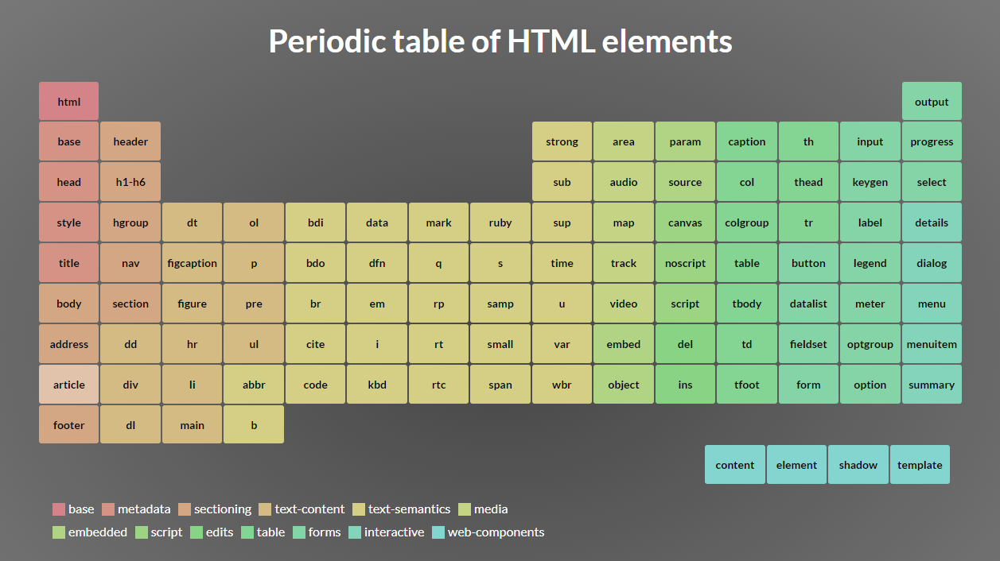
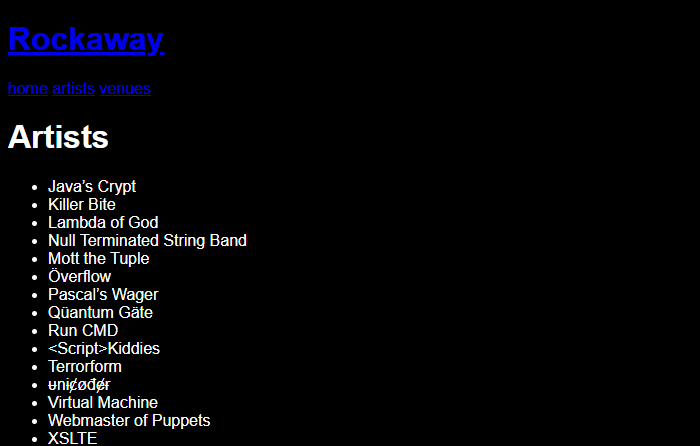

## Layouts

The pages we've created in the previous sections don't look like much. We're going to fix that, but first we're going to impose some structure and consistency on the pages used in our application.

Our app is using a combination of Razor Pages and MVC Views; ideally, we'd like to reuse as much of our frontend code as possible so we don't need to maintain two copies of everything. Let's start by setting up a common page layout, header and footer.

First, create two new files at the root of our web application:

**Rockaway.WebApp/_ViewStart.cshtml:**

```html

```

**Rockaway.WebApp/_ViewImports.cshtml:**

```html

```

> Most .NET project templates put `_ViewStart` in the `~/Views/` or the `~/Pages/` folder, but the Razor engine will actually find them anywhere in the project's folder hierarchy, so by putting them in the project root, both the MVC Views engine and the Razor Pages engine will find the **same file**.

Take a quick look at the error messages we get now:

Browsing to `/artists` (which is a Razor Pages page) gives us:

```
InvalidOperationException: The layout view '_Layout' could not be located. The following locations were searched:
/Pages/_Layout.cshtml
/Pages/Shared/_Layout.cshtml
/Views/Shared/_Layout.cshtml

Microsoft.AspNetCore.Mvc.Razor.RazorView.GetLayoutPage(ViewContext context, string executingFilePath, string layoutPath)
```

whereas browsing to `/status`, which is an MVC view, gives:

```
InvalidOperationException: The layout view '_Layout' could not be located. The following locations were searched:
/Views/Status/_Layout.cshtml
/Views/Shared/_Layout.cshtml
/Pages/Shared/_Layout.cshtml

Microsoft.AspNetCore.Mvc.Razor.RazorView.GetLayoutPage(ViewContext context, string executingFilePath, string layoutPath)
```

Looks like we can put our layout in either `/Views/Shared/_Layout.cshtml` OR in `/Pages/Shared/_Layout.cshtml`, and both engines will pick it up.

> If we wanted to put it somewhere completely different, like `/Common/Web/Things/Layouts/_Layout.cshtml`, we could do that too, but we'd need to specify the entire relative path name in `_ViewStart.cshtml`

I've decided we'll use `~/Views/Shared` for all our reusable bits of Razor code, so let's create a layout.

## A Word about Semantic Markup

Lots of modern websites are built using frameworks which produce markup like this:


That's not how do things around here. In this workshop, we're going to use semantic markup. Our page header will be a `<header>` tag, our footer will be a `<footer>`. The main bit of the page will be `<main>`. We'll organise content using `<section>`, we'll use `<nav>` and `<label>` and `<fieldset>` and all the other weird and wonderful tags that browsers know about.



<figcaption>The Periodic Table of HTML elements: <a href="https://madebymike.github.io/html5-periodic-table/">madebymike.github.io/html5-periodic-table</a></figcaption>

Here's the layout page we're going to kick off with:

**Rockaway.WebApp/Views/Shared/_Layout.cshtml:**

```html

```

## Syntactically Awesome Stylesheets

Cascading Style Sheets -- CSS -- is one of the technologies that developers love to hate. Working with poorly authored CSS can be a horribly frustrating experience.


CSS doesn't have to be horrible, though. 

We're going to use a technology called SASS, that gives us far more power and flexibility when it comes to creating and managing the CSS that's used on our site. You can read all about SASS at https://sass-lang.com/.

### SASS vs SCSS

The SASS compiler actually supports two different dialects of "awesome CSS":

SASS is a completely original syntax which, to my mind, looks like CSS would if it was invented by Python developers:

```css
/* SASS - using the .sass file extension */
$primary-color: green
$background-color: red
$fontsize: 25px

body
	color: $primary-color
	background: $background-color
	font-size: $fontsize
```

SCSS extends the basic CSS syntax with support for SASS features like variables, loops and functions:

```scss
/* SCSS - using the .scss file extension */
$bgcolor: blue;
$textcolor: red;
$fontsize: 25px;
 
body {
  background-color: $bgcolor;
  color: $textcolor;
  font-size: $fontsize;
}
```

I prefer SCSS, because I like curly braces, so that's what we're going to use in this workshop. 

### Running SASS in ASP.NET Core

There are several ways to run SASS as part of an ASP.NET web application. There's a Visual Studio extension called Web Compiler which compiles SASS as part of our development process, and there are various extensions which add SASS plugins for VS Code.

There's also a NuGet package called AspNetCore.SassCompiler, which will compile SCSS as part of your project build.

> The SASS compiler is written in a programming language called Dart. Rather than porting SASS to .NET, the SassCompiler project embeds the Dart interpreter and runs the native dart-sass implementation. Most of the time, this works brilliantly. Very occasionally, when running it on localhost using "watch mode", the dart.exe process won't shut down cleanly -- so if your Windows task manager reports a stray copy of `dart.exe` still running in the background, that's where it came from. On production systems, dart is only invoked during the project build so never runs on your live servers.

We're going to install the SASS compiler into Rockaway.WebApp:

```
dotnet add package AspNetCore.SassCompiler
```

Next, based on [these instructions](https://github.com/koenvzeijl/AspNetCore.SassCompiler#examples) we're going to add SASS support to our `appSettings.json` file:

```json
{
  "SassCompiler": {
    "SourceFolder": "Styles",
    "TargetFolder": "wwwroot/css",
    "Arguments": "--style=compressed",  
    // You can override specific options based on the build configuration
    "Configurations": {
      "Debug": { // These options apply only to Debug builds
        "Arguments": "--style=expanded"
      }
    }
  }
}
```

and enable the Sass Watcher component, which will rebuild our CSS whenever a .scss file is modified:

```csharp
#if DEBUG
builder.Services.AddSassCompiler();
#endif
```

We're using **conditional compilation** here. The code between `#if` and `#endif` will only be compiled when we're running a build with the `DEBUG` symbol defined; when we do a release-mode build, that code disappears completely. This is great for things like the SASS watcher which are useful for developers, but shouldn't be running anywhere near our live systems.

Now, let's wire in some SCSS:

**Rockaway.WebApp/Styles/styles.scss:**

```scss

```

Every time we build our project, or make a change to `styles.scss`, SassCompiler will regenerate `/wwwroot/css/styles.css`

Finally, we need to get our website to use this CSS file.

First, enable support for static files in `Program.cs`:

```csharp
app.UseRouting();
app.MapRazorPages();
app.MapControllerRoute(name: "default", pattern: "{controller=Home}/{action=Index}/{id?}");

// Add this line to enable support for static files:
app.UseStaticFiles();

app.Run();
```

and finally, add a `<link>` tag to the `<head>` of our layout page:

```html
<head>
	<meta charset="utf-8" />
	<meta name="viewport" content="width=device-width, initial-scale=1.0" />
	<title>@(ViewData["Title"] ?? "Rockaway")</title>
	<link type="text/css" rel="stylesheet" href="/css/styles.css" />
</head>
```

Now, when we browse to one of our pages, we'll see something like this:



Dark mode FTW.

It doesn't look like much, but all the pieces are in place now to start creating some CSS rules and making our site look like, well, like something people might actually use to buy tickets.


 
