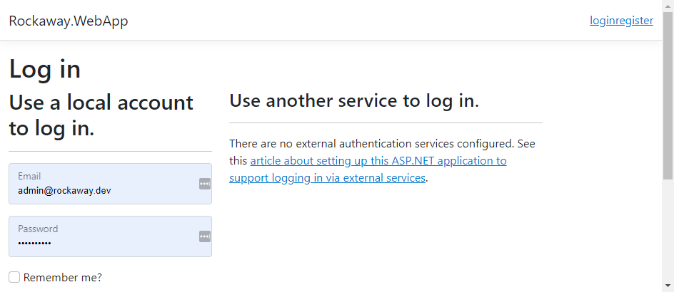

Before we add an admin area to our application, we're going to wire in some authentication and authorization support.

> Authentication and authorization in .NET is a complex topic that could easily fill a two-day training course on its own. All we're going to do here is wire up enough for you to see how the user registration, login, logout and other journeys work, and to see how the code in the various identity packages interacts with our pages and layouts.

First, we're going to install the two NuGet packages which provide identity management in ASP.NET Core:

```
dotnet add package Microsoft.AspNetCore.Identity.EntityFrameworkCore
dotnet add package Microsoft.AspNetCore.Identity.UI
```

We're going to use our existing database and DB context to manage our users and other identity information, so we need to make a few small changes to our DB context.

* `RockawayDbContext` needs to inherit from ` IdentityDbContext<IdentityUser>`
* We need to add a call to `base.OnModelCreating(builder)` at the top of our `OnModelCreating` override, so that our DB context will run the `IdentityDbContext` model creation code first, before running our Rockaway application code
* We're going to seed our `Users` table with an admin account.
  * For this workshop, we're using a very obvious account with a memorable password. Please don't do this on anything real, or you will have a Bad Time.

**Rockaway.WebApp/Data/RockawayDbContext.cs**

```csharp

```

Here's the code to add to `SampleData.cs`:

```csharp
public static class Users {
    static Users() {
        var hasher = new PasswordHasher<IdentityUser>();
        Admin = new() {
            Email = "admin@rockaway.dev",
            NormalizedEmail = "admin@rockaway.dev".ToUpperInvariant(),
            UserName = "admin@rockaway.dev",
            NormalizedUserName = "admin@rockaway.dev".ToUpperInvariant(),
            LockoutEnabled = true,
            EmailConfirmed = true,
            PhoneNumberConfirmed = true,
            SecurityStamp = Guid.NewGuid().ToString()
        };
        Admin.PasswordHash = hasher.HashPassword(Admin, "Top5ecret!");
    }
    public static IdentityUser Admin { get; }
} 
```

Inheriting from the `IdentityDbContext<IdentityUser>` actually adds a whole bunch of new tables and entities to our data model, so once we've done this, we'll need to generate a database migration to add these to our database, and then apply it:

```dotnetcli
dotnet ef migrations add SetUpAspNetIdentity
dotnet ef database update
```

As before, if we're using `database=sqlite`, it's all handled in `EnsureCreated()` so we can run our app locally without migrating any data.

Next we need to modify `Program.cs` to register the new identity providers.

After the call to `builder.Services.AddDbContext()`, add:

```csharp
builder.Services
	.AddDefaultIdentity<IdentityUser>()
	.AddEntityFrameworkStores<RockawayDbContext>();
```

and then after `app.UseRouting()`, add:

```csharp
app.UseAuthorization();
```

Next, we'll add a partial view called the `_LoginPartial`

> If you use Microsoft's code scaffolding tools to generate your authentication, you'll get a version of _LoginPartial added to your project. The code below is based on this, but I've edited it to suit the semantic markup conventions we're using in this project.

**Rockaway.WebApp/Views/Shared/_LoginPartial.cshtml:**

```html

```

We need to make a few tweaks to our CSS, so that the logout button renders the same as our nav links - add a rule that renders `nav > form` as `display: inline`, and replace the `a` selectors with `a, button`:

```scss
nav {
    form {
        display: inline;
    }

    a, button {
        border: 0;
        background: $brand-color;
        display: inline-block;
        padding: 4px 16px;
        color: #fff;
        font-size: 120%;
        border-radius: calc($border-radius / 2);

        &:hover {
            background: color.scale($brand-color, $lightness: +20%);
        }
    }

    @include smartphone {
        position: absolute;
        overflow-y: hidden;
        display: block;
        top: 0;
        left: 0;
        right: 0;
        height: 0;
        transition: height 0.2s ease;

        a, button {
            display: block;
            width: 100%;
            padding: 16px;
            border-radius: 0;
            border-top: 1px solid $foreground-color;
        }
    }
}
```


Finally, we'll plug in `_LoginPartial` to the `nav` element in our master page layout:

```html
<nav>
    <a href="/">home</a>
    <a asp-page="/artists">artists</a>
    <a asp-page="/venues">venues</a>
    <partial name="_LoginPartial" />
</nav>
```

et voila:


We also get a whole bunch of pages for free, which are shipped as part of the `Identity.UI` NuGet package. The only problem is... they don't look anything like our pages:



All the login, register, etc. pages are managed using an ASP.NET Core feature called **areas** -- and areas, by default, won't pick up things like common layout pages, so we'll need to repeat ourselves.

We'll create a new folder called `/Areas/Identity/Pages`, and create two new files in this folder:

**Rockaway.WebApp/Areas/Identity/Pages/_ViewStart.cshtml:**

```html

```

**Rockaway.WebApp/Areas/Identity/Pages/_ValidationScriptsPartial.cshtml:**

```html

```

We also need to add a line to our `_Layout.cshtml`, defining a section where the Identity code can render its own script blocks:

```html
	</footer>
	@await RenderSectionAsync("Scripts", false)
</body>
</html>
```

That'll give us registration and login pages that use our Rockaway look and feel:


Well, kinda.

All the pages provided with the Identity UI are designed to work with Microsoft's default Bootstrap-based look and feel, and consequently generate some idiosyncratic markup -- in this example, the `<label />` elements are *after* their associated controls, the idea being that there's then a whole heap of CSS and JavaScript which moves them back into the right place.

ASP.NET Core includes a code generation tool which will create local copies of all the pages used by the identity providers, giving us total control of our UI code.

You can find out more about that here:

[Scaffold Identity in ASP.NET Core Projects](https://learn.microsoft.com/en-us/aspnet/core/security/authentication/scaffold-identity?view=aspnetcore-7.0&tabs=visual-studio)

For now, all we're interested in is a way to log in and log out, so we can build authenticated user journeys, so we're going to wrap it up here.

## Resources and Further Reading:

* [Adding Authentication and Authorisation to ASP.NET Core Web Applications](https://endjin.com/blog/2022/03/adding-authentication-and-authorisation-to-aspnet-core-web-applications) by Elisenda Gascon at endjin.com
* [Scaffold Identity in ASP.NET Core Projects](https://learn.microsoft.com/en-us/aspnet/core/security/authentication/scaffold-identity?view=aspnetcore-7.0&tabs=visual-studio) at learn.microsoft.com


