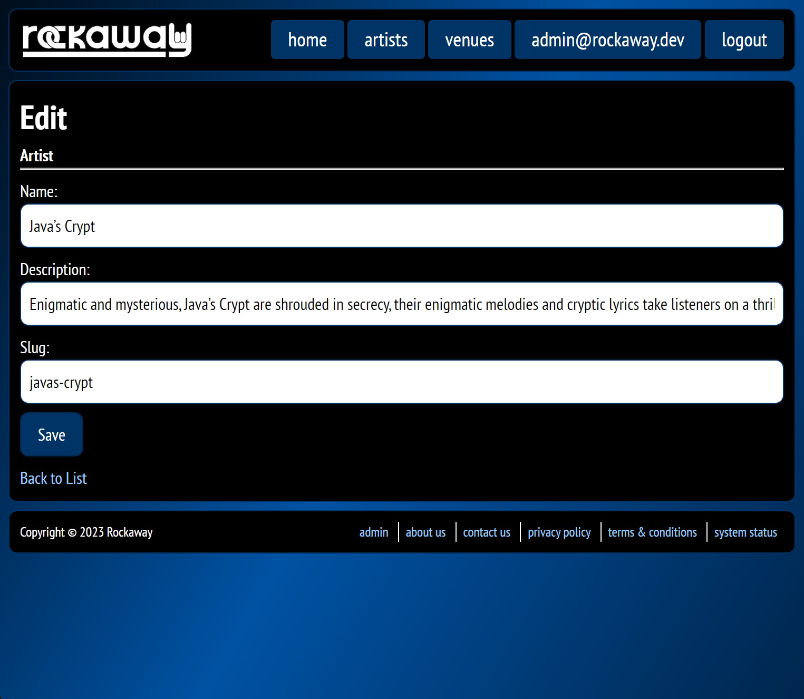

In the last module, we used dotnet's scaffolding tooling to create admin interfaces for our `Artist` and `Venue` entities. They work... but they don't look great, because the code generation tools make a bunch of assumptions about how we've structured our markup and CSS.

I tend to use a hybrid approach when apps are under active development:

*  Anything that's **end user facing** (i.e. the general public), I'll rebuild the forms and control the style all the way down.
* Anything that's **admin facing**, I'll use just enough CSS to make it look "ok", ship it, and iterate based on feedback.

The scaffold tools generate HTML which looks like this:

```html
<main>
<h1>Edit</h1>
<h4>Artist</h4>
<hr>
<div class="row">
        <div class="col-md-4">
			<form action="/admin/artists/edit/aaaaaaaa-aaaa-aaaa-aaaa-aaaaaaaaaa10" method="post">
			<input type="hidden" data-val="true" data-val-required="The Id field is required." id="Id" name="Id" value="aaaaaaaa-aaaa-aaaa-aaaa-aaaaaaaaaa10">
			<div class="form-group">
				<label class="control-label" for="Name">Name</label>
				<input class="form-control" type="text" data-val="true" data-val-maxlength="The field Name must be a string or array type with a maximum length of '100'." data-val-maxlength-max="100" data-val-required="The Name field is required." id="Name" maxlength="100" name="Name" value="Java’s Crypt">
				<span class="text-danger field-validation-valid" data-valmsg-for="Name" data-valmsg-replace="true"></span>
			</div>
			<div class="form-group">
				<label class="control-label" for="Description">Description</label>
				<input class="form-control" type="text" data-val="true" data-val-maxlength="The field Description must be a string or array type with a maximum length of '500'." data-val-maxlength-max="500" data-val-required="The Description field is required." id="Description" maxlength="500" name="Description" value="Enigmatic and mysterious, Java’s Crypt are shrouded in secrecy, their enigmatic melodies and cryptic lyrics take listeners on a thrilling journey through the unknown realms of music.">
				<span class="text-danger field-validation-valid" data-valmsg-for="Description" data-valmsg-replace="true"></span>
		</div>
		<div class="form-group">
			<label class="control-label" for="Slug">Slug</label>
				<input class="form-control" type="text" data-val="true" data-val-maxlength="The field Slug must be a string or array type with a maximum length of '100'." data-val-maxlength-max="100" data-val-regex="Slug must be 2-100 characters and can only contain letters a-z, digits 0-9, and hyphens. It cannot start or end with a hyphen." data-val-regex-pattern="^[a-z0-9][a-z0-9-]{0,98}[a-z0-9]$" data-val-required="The Slug field is required." id="Slug" maxlength="100" name="Slug" value="javas-crypt">
                <span class="text-danger field-validation-valid" data-valmsg-for="Slug" data-valmsg-replace="true"></span>
            </div>
            <div class="form-group">
                <input type="submit" value="Save" class="btn btn-primary">
            </div>
        <input name="__RequestVerificationToken" type="hidden" value="CfDJ8KVJg2OGit9NspM46kenzoCsaCkO5awrz90QOa1OeJepgb7VUA7_u7qGcSC_hdbd4LU5YoGmH98chM4_Y-1bgBbIlWWXeaW7fxuh7fT6DgMLz6HZ5Bj72qU6TnUFVAjffyKbBHQ1BCgvD7H3DDrwjbEV6ckYy_GfmNLSn4L7F_lklZFVlMPuKysEvjDx0khKYQ"></form>
    </div>
</div>

<div>
    <a href="/admin/artists">Back to List</a>
</div>
</main>
```

So we're going to create some minimal CSS which will apply some basic formatting to those elements.

Add this to our `styles.scss`:

```scss
form {
    div.form-group {
        margin: 8px 0;

        label {
            width: 6em;
            display: inline-block;
            text-align: left;

            &::after {
                content: (':');
            }
        }

        input[type=text] {
            padding: 8px;
            border: 1px solid $brand-color;
            border-radius: $border-radius;
            width: 100%;
        }
    }

    button, input[type=submit], input[type=reset], input[type=button] {
        color: $foreground-color;
        background-color: $brand-color;
        border: 1px solid color.scale($brand-color, $lightness: -25%);
        padding: $gutter $gutter * 2;
        border-radius: $border-radius;
    }
}
```

That'll give us a form something like this:


